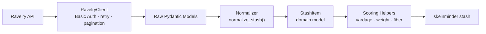
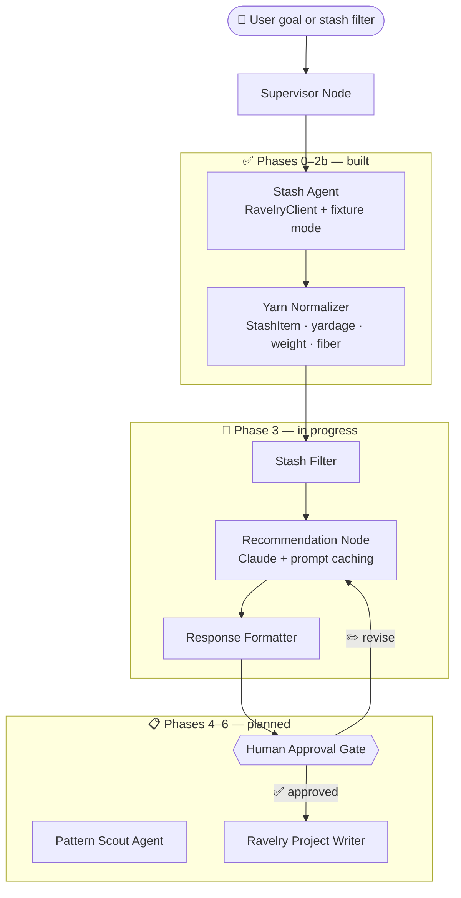

# SkeinMinder

A Ravelry-powered multi-agent studio planner.

Every knitter knows the problem: a stash full of beautiful yarn and no idea what to do with it. SkeinMinder connects to your Ravelry account, reads your stash, and uses a multi-agent LangGraph system to recommend feasible projects — matched to your yarn, your timeline, and your ambitions. It only writes back to Ravelry after you approve.

---

## How it works today



## Where it's going



---

## Stack

- Python 3.13 · uv · Pydantic v2
- LangGraph (stateful multi-agent orchestration)
- httpx · tenacity (Ravelry API client, retry on 429/5xx)
- Claude via `langchain-anthropic` (with prompt caching)
- pytest · ruff · mypy strict · GitHub Actions CI

---

## Roadmap

| Phase | Description | Status |
|---|---|---|
| 0 | Project setup (uv, ruff, mypy, CI) | ✅ Complete |
| 1 | Ravelry read-only client | ✅ Complete |
| 2 | Stash normalization and scoring | ✅ Complete |
| 3 | LangGraph MVP — stash-to-recommendation | 🔄 In progress |
| 4 | Pattern search and candidate matching | 📋 Planned |
| 5 | Human approval checkpoints | 📋 Planned |
| 6 | Ravelry project write-back | 📋 Planned |

---

## Quick start

```bash
# Install
git clone https://github.com/ReneeErnst/skein-minder.git
cd skein-minder
uv sync

# Try it without Ravelry credentials (uses committed fixture data)
skeinminder stash --fixture

# Live mode: copy .env.example → .env and add your Ravelry API credentials
skeinminder stash
```

Live mode requires a Ravelry "Personal Account Access" app — the stash endpoint requires write-level auth even for reads. See `.env.example` for the required variables.

---

## Development

```bash
make lint        # ruff check
make format      # ruff format
make typecheck   # mypy strict
make test        # pytest
make check       # full CI check (pre-commit + pytest)
```

Tests never hit the live Ravelry API — all HTTP is routed through `FixtureTransport`, a custom `httpx` transport backed by committed JSON fixtures.
