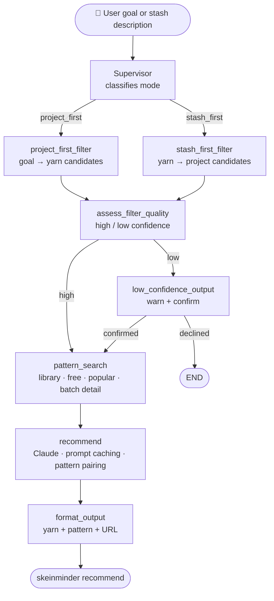
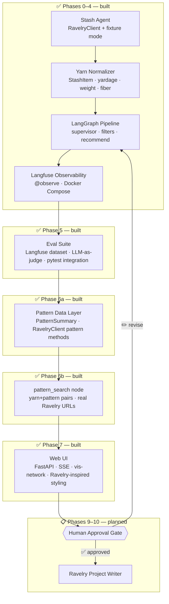

# SkeinMinder

A Ravelry-powered multi-agent studio planner.

Every knitter knows the problem: a stash full of beautiful yarn and no idea what to do with it. SkeinMinder connects to your Ravelry account, reads your stash, and uses a multi-agent LangGraph system to recommend feasible projects — matched to your yarn, your timeline, and your ambitions. It only writes back to Ravelry after you approve.

---

## How it works today



Every node is instrumented with Langfuse `@observe` spans. Run `docker compose up -d` to stand up a local Langfuse instance and see traces in the UI.

## Where it's going



---

## Stack

- Python 3.13 · uv · Pydantic v2
- LangGraph (stateful multi-agent orchestration)
- FastAPI + uvicorn · SSE · vis-network (web UI)
- httpx · tenacity (Ravelry API client, retry on 429/5xx)
- Claude via `langchain-anthropic` (with prompt caching)
- Langfuse (graph tracing · self-hosted via Docker Compose)
- pytest · ruff · mypy strict · GitHub Actions CI

---

## Roadmap

| Phase | Description | Status |
|---|---|---|
| 0 | Project setup (uv, ruff, mypy, CI) | ✅ Complete |
| 1 | Ravelry read-only client | ✅ Complete |
| 2 | Stash normalization and scoring | ✅ Complete |
| 3 | LangGraph MVP — stash-to-recommendation | ✅ Complete |
| 4 | Tracing and observability (Langfuse) | ✅ Complete |
| 5 | Eval suite (deterministic assertions + LLM-as-judge) | ✅ Complete |
| 6a | Pattern data layer (client methods, PatternSummary, fixtures) | ✅ Complete |
| 6b | Pattern graph integration (pattern_search node, yarn+pattern pairs) | ✅ Complete |
| 7 | Web UI (FastAPI + SSE, vis-network graph animation, Ravelry-inspired styling) | ✅ Complete |
| 8 | Performance and cleanup (parallel pattern search, async pagination, streaming) | 📋 Planned |
| 9 | Human approval checkpoints | 📋 Planned |
| 10 | Ravelry project write-back | 📋 Planned |

---

## Quick start

```bash
# Install
git clone https://github.com/ReneeErnst/skein-minder.git
cd skein-minder
uv sync

# Try it without Ravelry credentials (uses committed fixture data)
skeinminder stash --fixture
skeinminder recommend "I want to make a fall cardigan" --fixture

# Web UI (browser at http://localhost:8000 — also works without credentials)
skeinminder web --fixture

# Live mode: copy .env.example → .env and add your credentials
skeinminder stash
skeinminder recommend "I have 900 yards of worsted — what can I make?"
```

Live mode requires a Ravelry "Personal Account Access" app — the stash endpoint requires write-level auth even for reads. See `.env.example` for the required variables.

---

## Development

```bash
make lint        # ruff check
make format      # ruff format
make typecheck   # mypy strict
make test        # pytest
make check       # full CI check (pre-commit + pytest)
```

Tests never hit the live Ravelry API — all HTTP is routed through `FixtureTransport`, a custom `httpx` transport backed by committed JSON fixtures.

### Local observability

To see Langfuse traces while developing:

```bash
docker compose up -d        # start Langfuse + Postgres (http://localhost:3000)
# log in: dev@example.com / devpassword123

# Copy the pre-seeded keys into .env:
LANGFUSE_PUBLIC_KEY=lf-pk-skeinminder-local
LANGFUSE_SECRET_KEY=lf-sk-skeinminder-local
LANGFUSE_HOST=http://localhost:3000

# One-time bootstrap: registers model pricing and creates the eval dataset.
# Re-run this any time you reset volumes (docker compose down -v).
uv run python -m skeinminder.scripts.setup_langfuse_dataset

skeinminder recommend "I want a quick hat" --fixture  # generates a trace
```

Traces appear under the `skein-minder` project in the Langfuse UI. Each `skeinminder recommend` call creates one root trace (`skeinminder-recommend`) with child spans for every graph node. Token counts and cost appear on the `recommend` generation.

**Production note:** In a self-hosted production deployment, run the setup script as part of your deployment bootstrap. If using Langfuse Cloud, model pricing is pre-configured and the setup script only needs to create the eval dataset.

### Eval suite

The eval suite has two layers: deterministic assertions (fast, no LLM, CI-safe) and LLM-as-judge scoring (logged to Langfuse).

```bash
# First-time setup: create the Langfuse dataset and upsert golden examples
uv run python -m skeinminder.scripts.setup_langfuse_dataset

# Run the full eval (all golden examples — requires ANTHROPIC_API_KEY and Langfuse running)
skeinminder eval

# Run a single example by id
skeinminder eval --example-id project-first-cardigan

# Deterministic assertions only (fast, no LLM calls — runs in CI)
uv run pytest -m eval
```

Golden examples live in `tests/fixtures/eval/`. Each has an `input`, `expected` properties (stash IDs, weight constraints), and a `judge_criteria` string used for LLM scoring. Results are logged as Langfuse scores on the corresponding trace.
